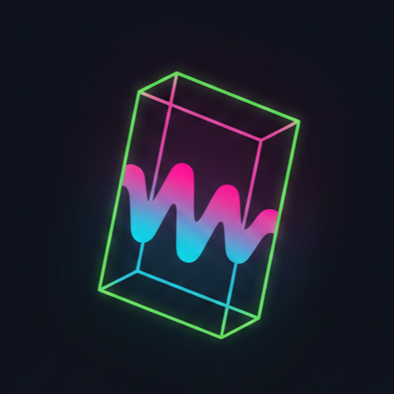

# VibeGeometry: Dynamic Audio Visualizer

<p align="center">
  
</p>

<h1 align="center">VibeGeometry</h1>

<p align="center">
  <strong>A high-performance, interactive 3D audio visualizer built for the modern web.</strong>
</p>

<p align="center">
  
  
  
</p>

---

## 🎧 Transform Sound into Space

**VibeGeometry** is a cutting-edge web application that bridges the gap between audio and visual art. By leveraging the power of **Three.js** and the **Web Audio API**, it translates your favorite tracks into a living, breathing 3D landscape.

Experience a reactive grid of pulsating geometries that respond to real-time frequency data, set against a deep cosmic starfield and a sleek, reflective floor. Whether you're looking for a mesmerizing desktop wallpaper or exploring the synergy of math and music, VibeGeometry delivers an immersive, low-latency visual experience.

## ✨ Features

- **Real-time Audio Visualization:** Bars react dynamically to frequency data from your music.
- **Dynamic Color Palette:** Individual bars change color based on their amplitude, from cool blues to vibrant reds.
- **Reflective Floor:** A polished, dark floor adds depth and enhances the visual spectacle with stunning reflections.
- **Starfield Background:** A subtle, rotating particle field creates an immersive cosmic ambiance.
- **Smooth Camera Animation:** A gently orbiting camera provides an ever-changing perspective.
- **Clean, Minimalist UI:** Intuitive controls for audio playback (play/pause, rewind/fast-forward, volume, seek bar) and a toggleable interface.
- **Modular Codebase:** Well-structured JavaScript (ESM) for easy understanding and expansion.

## 🚀 Getting Started

### Prerequisites

You only need a modern web browser!

### Installation & Running

1.  **Clone the repository:**
    ```bash
    git clone https://github.com/PsydoV2/VibeGeometry.git
    cd VibeGeometry
    ```
2.  **Open with a Live Server:**
    Due to browser security restrictions (`file://` protocol limitations for ES Modules and audio loading), you need to serve the files using a local web server.
    - **VS Code:** Install the "Live Server" extension, right-click `index.html`, and select "Open with Live Server".
    - **Python:** In your project directory, run `python -m http.server` and navigate to `http://localhost:8000` in your browser.

## 🎧 Usage

1.  **Upload Audio:** Click "Track wählen" to upload an MP3 or other audio file from your device.
2.  **Visualize:** Watch the 3D grid come alive!
3.  **Control Playback:** Use the on-screen buttons for play/pause, volume adjustment, and seeking through the track.
4.  **Hide UI:** Click the menu icon (☰) to hide the UI for an uninterrupted visual experience. Click it again to reveal.

## ⚙️ Technologies Used

- **Three.js:** For all 3D rendering and scene management.
- **Web Audio API:** For real-time audio analysis.
- **Lucide Icons:** For clean and modern UI iconography.
- **Vanilla JavaScript (ES Modules):** For a lightweight and modular architecture.

## 🔮 Future Enhancements (Ideas)

- Add customizable color palettes.
- Implement different visualization modes (e.g., sphere, waveform).
- Integrate microphone input for live visualization.
- Option to change grid density.
- Post-processing effects (e.g., Bloom, DOF).

## 🤝 Contributing

Feel free to fork the repository, open issues, or submit pull requests. Any contributions are welcome!

## 📄 License

This project is open source and available under the [MIT License](LICENSE).
